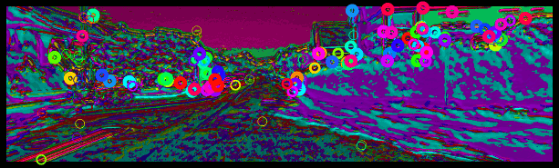
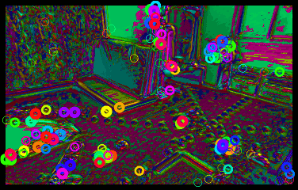
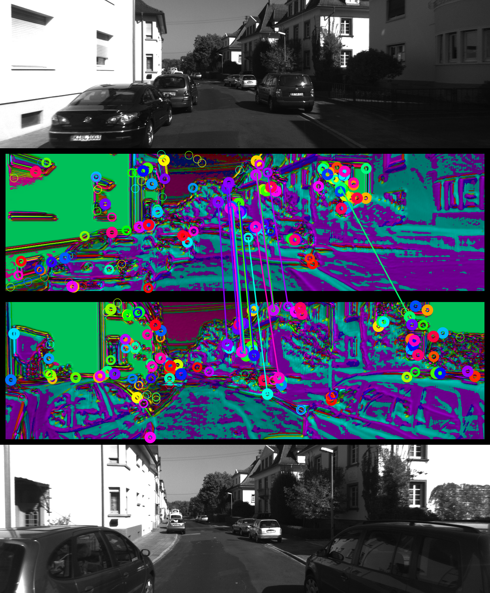
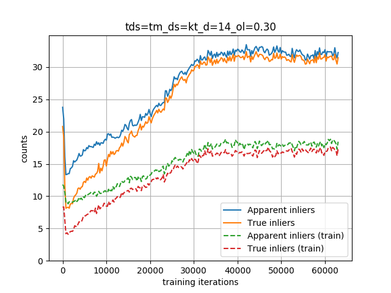

# Matching Features without Descriptors: Implicitly Matched Interest Points




This is the code for the 2019 BMVC paper **Matching Features without Descriptors: Implicitly Matched Interest Points** ([PDF](http://rpg.ifi.uzh.ch/docs/BMVC19_Cieslewski.pdf)) by [Titus Cieslewski](http://rpg.ifi.uzh.ch/people_titus.html), Michael Bloesch and [Davide Scaramuzza](http://rpg.ifi.uzh.ch/people_scaramuzza.html). When using this, please cite:

```bib
@InProceedings{Cieslewski19bmvc,
  author        = {Titus Cieslewski and Michael Bloesch and Davide Scaramuzza},
  title         = {Matching Features without Descriptors:
                  Implicitly Matched Interest Points},
  booktitle     = {British Machine Vision Conference (BMVC)},
  year          = 2019
}
```

## Supplementary Material

The supplementary material mentioned in the paper can be found at http://rpg.ifi.uzh.ch/datasets/imips/supp_imips.zip .

## Installation

We recommend working in a [virtual environment](https://packaging.python.org/guides/installing-using-pip-and-virtual-environments/) (also when using ROS/catkin)
```bash
pip install --upgrade opencv-contrib-python==3.4.2.16 opencv-python==3.4.2.16 ipython \
    pyquaternion scipy absl-py hickle matplotlib sklearn tensorflow-gpu cachetools
```

### With ROS/catkin

```bash
sudo apt install python-catkin-tools
mkdir -p imips_ws/src
cd imips_ws
catkin config --init --mkdirs --extend /opt/ros/<YOUR VERSION> --merge-devel
cd src
git clone git@github.com:catkin/catkin_simple.git
git clone git@github.com:uzh-rpg/imips_open.git
git clone git@github.com:uzh-rpg/imips_open_deps.git
catkin build
. ../devel/setup.bash
```

### Without ROS/catkin

```bash
mkdir imips_ws
cd imips_ws
git clone git@github.com:uzh-rpg/imips_open.git
git clone git@github.com:uzh-rpg/imips_open_deps.git
```
Make sure `imips_open_deps/rpg_common_py/python`, `imips_open_deps/rpg_datasets_py/python` and `imips_open/python` are in your `PYTHONPATH`.

### Get pre-trained weights

Download the weights from http://rpg.ifi.uzh.ch/datasets/imips/tds=tm_ds=kt_d=14_ol=0.30.zip and extract them into `python/imips/checkpoints`.

## Inference

### Test using our data

Follow [these instructions](https://github.com/uzh-rpg/imips_open_deps/tree/master/rpg_datasets_py) to link up KITTI. To speed things up, you can download http://rpg.ifi.uzh.ch/datasets/imips/tracked_indices.zip and extract the contained files to `python/imips/tracked indices` (visual overlap precalculation). Then, run:
```bash
python render_matching.py --tds=tm --ds=kt --depth=14 --ol=0.3 --val_best --testing
```
This will populate `results/match_render/tds=tm_ds=kt_d=14_ol=0.30_kt_testing` with images like the following:



## Training

(Re)move the previously downloaded checkpoints. Follow [these instructions](https://github.com/uzh-rpg/imips_open_deps/tree/master/rpg_datasets_py) to link up TUM mono. Then, run:
```bash
python train.py --tds=tm --ds=kt --depth=14 --ol=0.3
```

To visualize training progress, you can run:
```bash
python plot_val_metrics.py --tds=tm --ds=kt --depth=14 --ol=0.3
```
in parallel. Here is what it should look like after around 60k iterations:



Note that inlier counts drop initially. This is normal.
